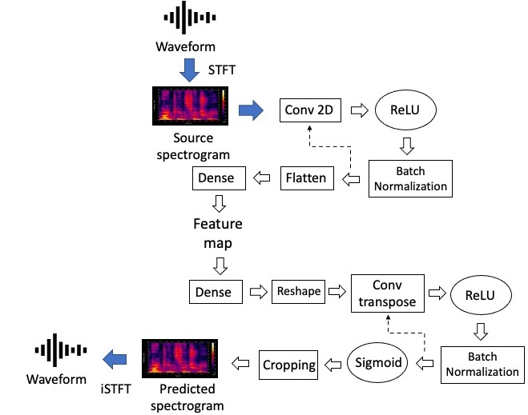

Generating music with pitch and rhythm has received ample attentions from researchers. By contrast, noise music as a special genre is largely ignored so far. This paper aims to generate noise music in ‘Merzbow style’ using a neural network called variational autoencoder (VAE). Result shows that our proof-of-concept system is capable of generating noise music. Examples of output that are audio samples that can be listened on our website.

Audio samples can be listened here:

